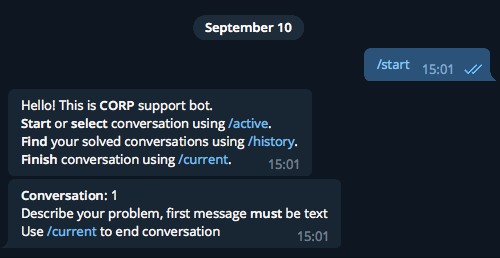
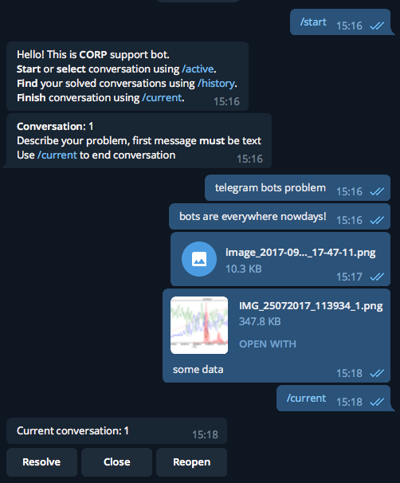
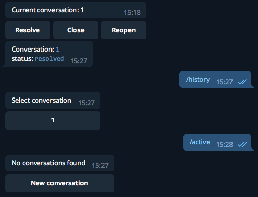
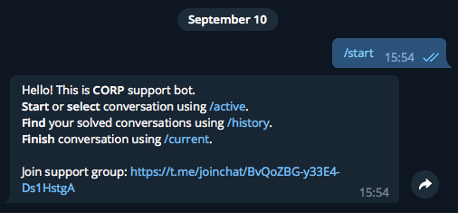
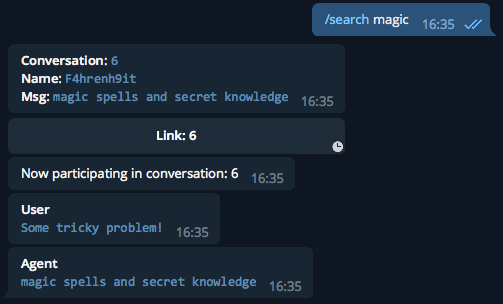
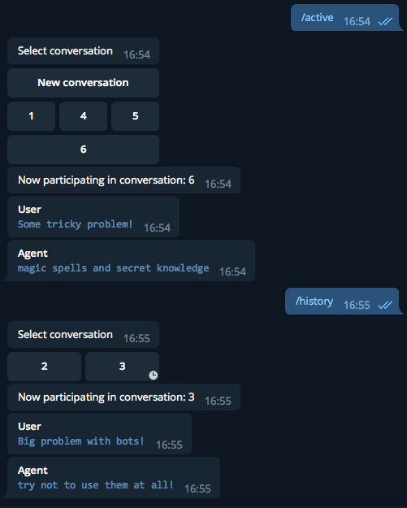
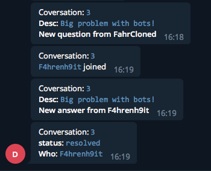
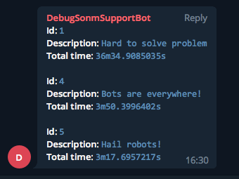

#### Converse
###### Telegram support bot
###### Prequesites:
- docker, docker-compose

Install:
1. Create new bot token using Telegram Bot Father, insert into *bot.yaml*
2. Create support chat only for agents, insert invite link to *bot.yaml*
3. Fill your support Agents data in *bot.yaml*
   ```
    bot_token: ""
    bot_company_name: CORP
    delivery_ratelimit: 30 // telegram limits up to 30 messages/sec from one bot
    support_chatid: -297716605
    support_link: https://t.me/joinchat/... // Options->Manage group->Create invite link
    default_sla: 12 # default sla in hours
    agents:
        - name: "agent1"
          chatid: *your_userid_here*
        - name: "agent2"
          chatid: *your_userid_here*
    db:
        # postgres connection settings (container)
        host: "127.0.0.1"
        dbname: "tgsup"
        user: "tgsup"
        password: "tgsup"
        sslmode: "disable"
        # creates schema and migrate db, set true for initial setup, then false when restarting
        migrate: true
   ```

4. Run (you need docker, docker-compose installed)
   ```
   docker-compose build && docker-compose up
   ```

### Usage manual
#### User
On the first start conversation will be automatically created and you will be registered



Enter short description of your problem, then feel free describe it precisely and attach any files

When problem is solved, press [/current]() to end conversation


After that you may open another conversation using [/active]() or select any resolved/closed conversation using [/history]()



#### Agent
On the first start use invite link to join support chat



From agent point of view you can participate in any conversation, one at a time, using [/active](), or review/reopen conversation from [/history]()

Use [/search]() **any text or caption of msg** when talking to bot to reveal helpful solutions from your history



All conversation data stored in database before forwarding to Telegram, and will be restored when you join conversation, so in case of history glitch you will not lose any of your data



#### Support chat
In support chat one can see notifications of users and agents actions



Use [/list]() in *support chat* to see relevant conversations, ordered by time spent



#### TODO

- [ ] Create rate system, agent can sent messages with inline rate keyboard, conversation will end with this keyboard too
- [ ] Improve search command with filters
- [ ] Refactor routers, stub telegram Api and test conversation logic
- [ ] Create support statistics (support chat)
